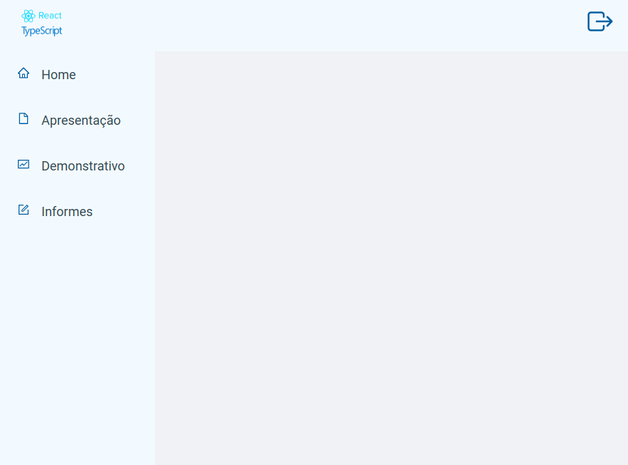

#

<h1
    align="center">
    

    Auth-Token

</h1>

## ✅ Sobre o projeto

Este projeto tem por objetivo a realização de exercícios demonstrando alguns dos recursos do React e do Typescript, no desenvolvimento de FrontEnd's, com a biblioteca styled-components.


Este projeto apresenta as funcionalidades para autenticação de usuários via Token.

## ✅ Tecnologias

As seguintes ferramentas foram, as principais, usadas na construção do projeto:

- [React](https://reactjs.org/)
- [Typescript](https://www.typescriptlang.org/)
- [Styled Components](https://styled-components.com/)
- ...

## ✅ Começando

As instruções a seguir fornecerão uma cópia do projeto em sua máquina local para fins de desenvolvimento e testes. Não existem restrições, utilize como desejar.

### Pré-requisitos

É necessário que tenha instalado em sua máquina, os recursos listados abaixo. Se não tiver, instale-os, antes de continuar.

- [Node.js](https://nodejs.org/)

### Instalando

Clone a projeto:

```bash
git clone https://github.com/antoniojpprado/auth-token.git
```

Acesse o diretório do projeto:

```bash
cd auth-token/frontend
```

Instale as dependências do projeto:

```bash
yarn install
```

## ✅ Uso

Inicie o projeto:

```bash
yarn start
```

## ✅ Contribuindo

Caso tenha sugestões, <a href="mailto:antoniojpprado@gmail.com">entre em contato. Será muito bom poder melhorar, qualquer detalhe que seja.</a>.

## ✅ Licença

Todos os arquivos são cobertos pela GNU - Licença Pública Geral, consulte LICENSE.